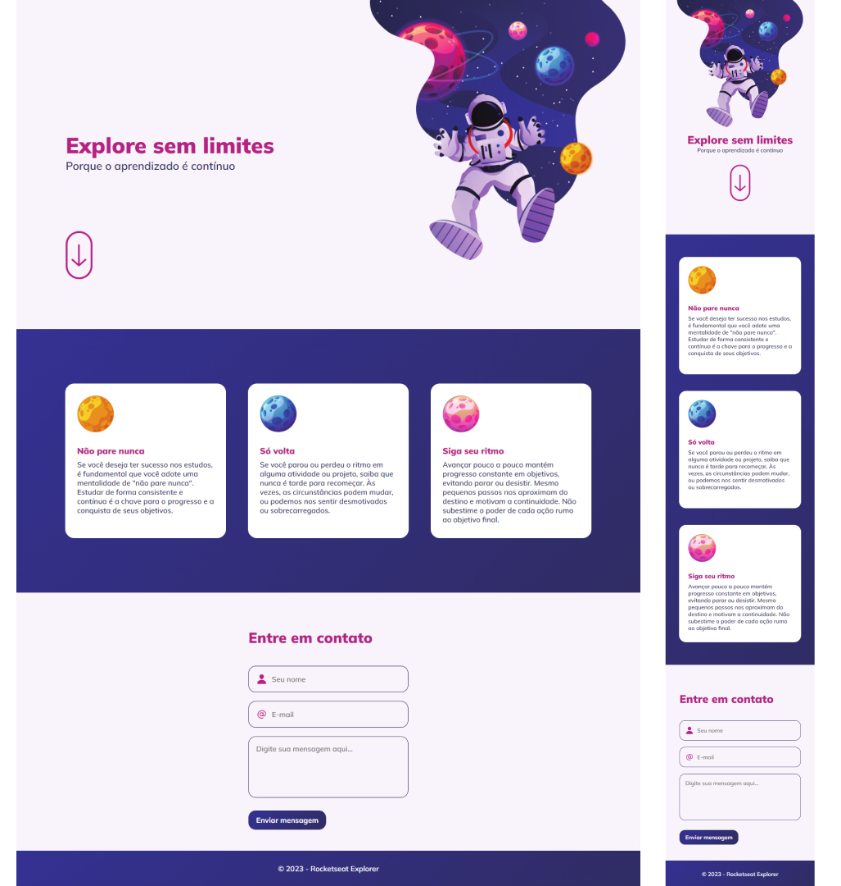

<h1 align="center">Projeto Setups Blog</h1>

  <a href="#-preview">Preview</a>&nbsp;&nbsp;&nbsp;|&nbsp;&nbsp;&nbsp;
  <a href="#-tecnologias">Tecnologias</a>&nbsp;&nbsp;&nbsp;|&nbsp;&nbsp;&nbsp;
  <a href="#-projeto">Projeto</a>&nbsp;&nbsp;&nbsp;|&nbsp;&nbsp;&nbsp;
  <a href="#-layout">Layout</a>

 

## 🖥 Preview

## 🚀 Tecnologias

Esse projeto foi desenvolvido com as seguintes tecnologias:

- HTML e CSS
- Git e Github
- Figma

## 💻 Projeto

O projeto Explore Sem Limites é uma página web, responsiva para desktop e mobile, com visual moderno e divida em seções (header, main, contact e footer).
Com um formulário de contato totalmente personalizado ao fim da página.

## 🔖 Layout

Você pode visualizar o layout do projeto através [DESSE LINK](https://www.figma.com/design/PavbZikseCrzuah5OiaqUw/Explore-sem-limites-(Copy)?m=auto&t=I5FJmv8RRceC57y0-6), no Figma. 
designed by Rocketseat